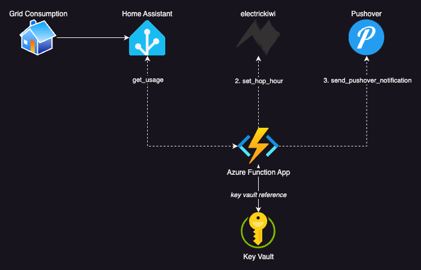

# Hour of Power Optimiser

[Electric Kiwi](https://www.electrickiwi.co.nz/) offers a free selectable [Hour of Power](https://www.electrickiwi.co.nz/power/hour-of-power) every day with the feature that any change before midnight will be active for that day.

This provides us with an opportunity to analyse the days KWh usage just before midnight and set the Hour of Power based on the peak usage to provide maximum cost savings

We pull the usage data from Home Assistant, (*you can read my blog post about getting power consumption data into Home Assistant [here](https://blog.malleynet.xyz/posts/electrickiwi/part1/)*) And analyse it using the python library pandas, before setting the optimal Hour of Power and notify the user via [pushover](https://pushover.net/) 



## Development

### Requirements

- Python
- [Azure Functions Core tools](https://learn.microsoft.com/en-us/azure/azure-functions/functions-run-local?tabs=macos%2Cisolated-process%2Cnode-v4%2Cpython-v2%2Chttp-trigger%2Ccontainer-apps&pivots=programming-language-python)
- [Azurite](https://learn.microsoft.com/en-us/azure/storage/common/storage-use-azurite?tabs=visual-studio-code%2Cblob-storage) (Azure Storage emulator)

### Steps
1. Create a file called `src/local.settings.json`
   1. This will contain your environment variables for development
   ```json
    {
    "IsEncrypted": false,
    "Values": {
        "FUNCTIONS_WORKER_RUNTIME": "python",
        "AzureWebJobsFeatureFlags": "EnableWorkerIndexing",
        "AzureWebJobsStorage": "UseDevelopmentStorage=true",
        "ELECTRIC_KIWI_EMAIL": "",
        "ELECTRIC_KIWI_PASSWORD": "",
        "HOME_ASSISTANT_ACCESS_TOKEN": "",
        "HOME_ASSISTANT_ENTITY_ID": "",
        "HOME_ASSISTANT_URL": "",
        "PUSHOVER_API_TOKEN": "",
        "PUSHOVER_USER_KEY": ""
        }
    }
   ```
2. Run `func start` to run your function